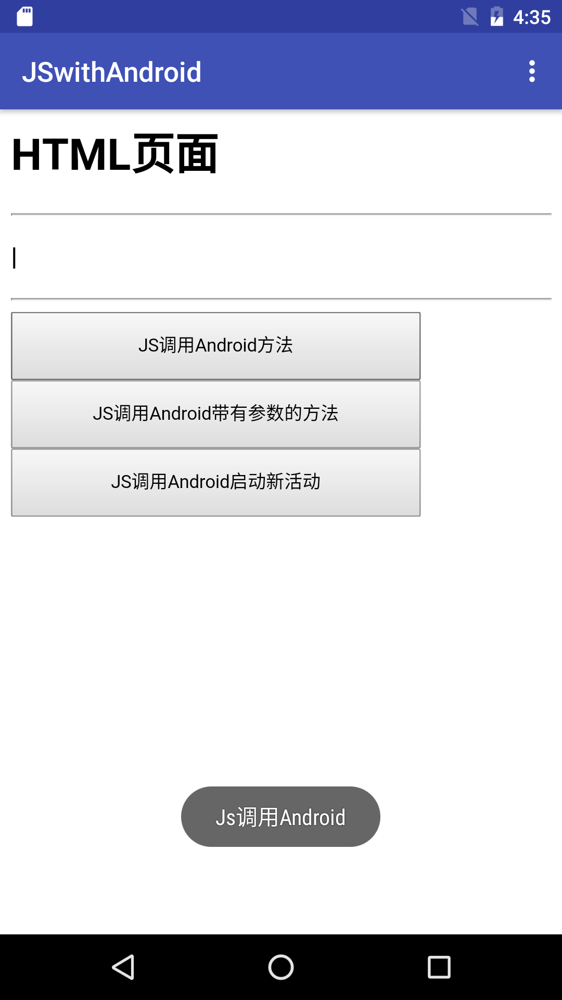
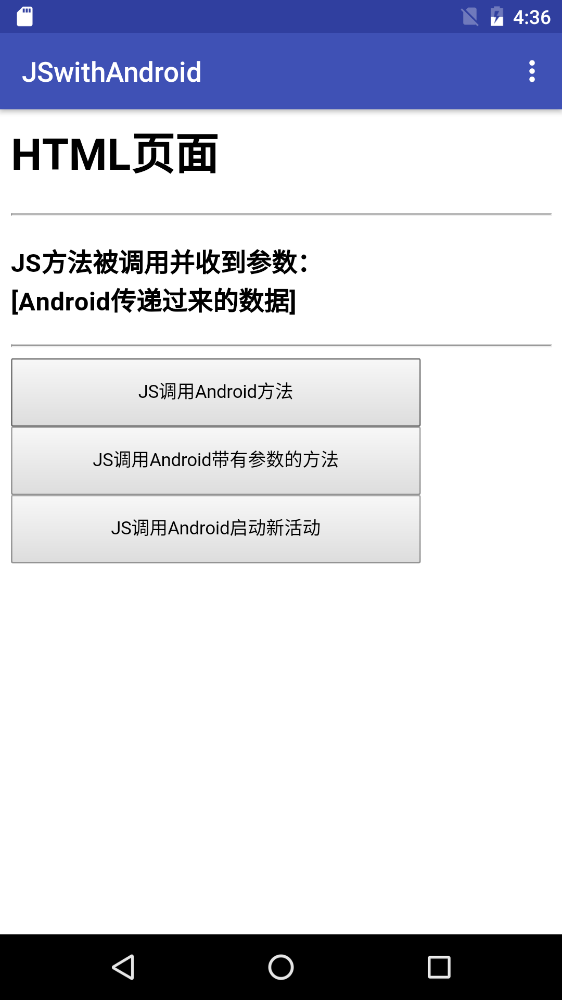

# JSwithAndroid
 Android端与js的相互调用
 ---
 html如下

       <html>
      <head>
      <meta http-equiv="Content-Type" content="text/html;charset=gb2312">
      
      </head>
      <body>
      <h1>HTML页面</h1>
      

      <h3>
|
</h3>
      

      <input type="button" style="width:300px;height:50px;" value="JS调用Android方法" onclick="window.android.JsCallAndroid()" />
       
      <input type="button" style="width:300px;height:50px;" value="JS调用Android带有参数的方法" onclick="window.android.JsCallAndroid('JS传递过来的数据')" />
       
      <input type="button" style="width:300px;height:50px;" value="JS调用Android启动新活动" onclick="window.android.JsCallAndroidStartNew()" />

      </body>
      </html>

有jsFunction() jsFunctionArg(arg）两个Js方法

调用了Android JsCallAndroid()、JsCallAndroid('JS传递过来的数据')、JsCallAndroidStartNew()三个方法

Android代码 MainActivity.java

          package com.example.deng.jswithandroid;

          import android.annotation.SuppressLint;
          import android.support.v7.app.AppCompatActivity;
          import android.os.Bundle;
          import android.view.Menu;
          import android.view.MenuItem;
          import android.webkit.WebView;
          import android.widget.RelativeLayout;
          import android.widget.Toast;

          public class MainActivity extends AppCompatActivity {

              private WebView mWebWebView;

              @SuppressLint("JavascriptInterface")
              @Override
              protected void onCreate(Bundle savedInstanceState) {
                  super.onCreate(savedInstanceState);
                  setContentView(R.layout.activity_main);
                  mWebWebView = (WebView) findViewById(R.id.web);
                  mWebWebView.loadUrl("file:///android_asset/www/index.html");
                  mWebWebView.getSettings().setJavaScriptEnabled(true);
                  JSObject jsObject = new JSObject(MainActivity.this);
                  mWebWebView.addJavascriptInterface(jsObject, "android");

              }

              @Override
              public boolean onCreateOptionsMenu(Menu menu) {
                  getMenuInflater().inflate(R.menu.menu,menu);
                  return true;
              }

              @Override
              public boolean onOptionsItemSelected(MenuItem item) {
                  int itemId = item.getItemId();
                  switch (itemId){
                      case R.id.method1:
                          mWebWebView.loadUrl("javascript:jsFunction()");
                          break;
                      case R.id.method2:
                          mWebWebView.loadUrl("javascript:jsFunctionArg('[Android传递过来的数据]')");
                          break;
                      default:break;
                  }
                  return super.onOptionsItemSelected(item);
              }
          }

核心代码
>mWebWebView.loadUrl("file:///android_asset/www/index.html");

>mWebWebView.getSettings().setJavaScriptEnabled(true);

>JSObject jsObject = new JSObject(MainActivity.this);

>mWebWebView.addJavascriptInterface(jsObject, "android");

JSObject.java

      /**
       * Created by deng on 16-11-17.
       * /

      public class JSObject {
          private final Context context;

          public JSObject(MainActivity mainActivity) {
              this.context=mainActivity;
          }
          @JavascriptInterface
          public String JsCallAndroid(){
              Toast.makeText(context,"Js调用Android",Toast.LENGTH_SHORT).show();
              return "Js调用Android";
          }
          @JavascriptInterface
          public String JsCallAndroid(String s){
              Toast.makeText(context,"Js调用Android"+s,Toast.LENGTH_SHORT).show();
              return "Js调用Android";
          }
          @JavascriptInterface
          public void JsCallAndroidStartNew(){
              Intent intent = new Intent();
              intent.setClass(context,Main2Activity.class);
              context.startActivity(intent);
          }
      }

切记调用方法必须加@JavascriptInterface

图一 Android代码被js调用

图二 js代码被Android调用
